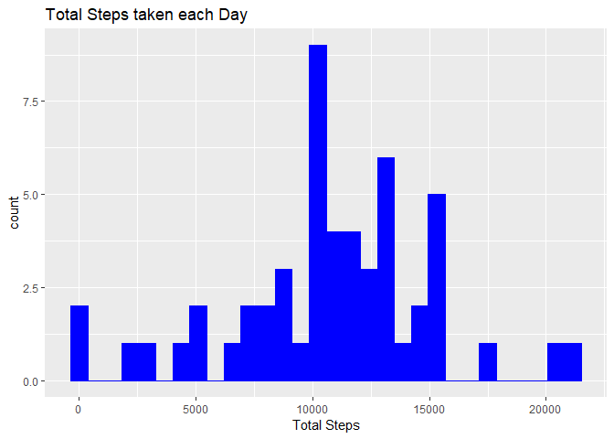
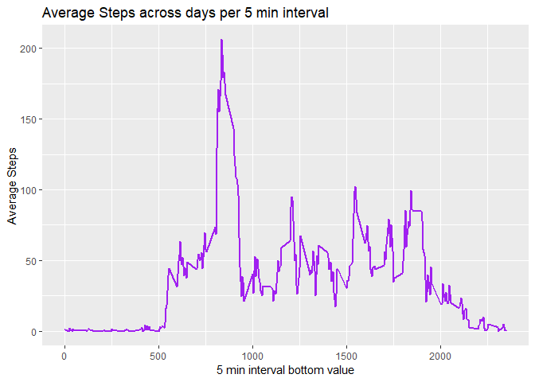
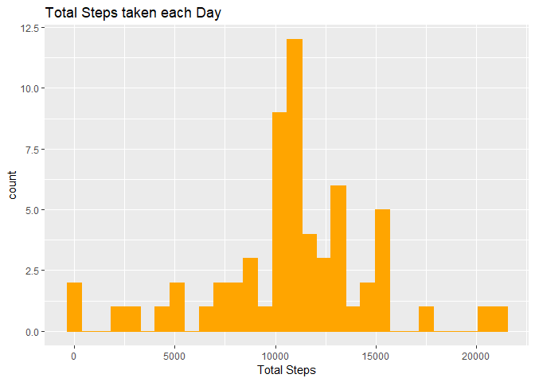
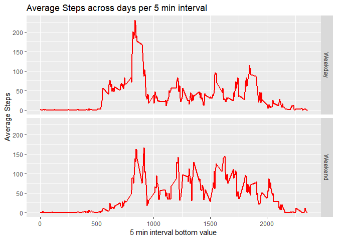

## Loading and preprocessing the data
First, we need to load the data from the csv contained in a zip file.


```r
library(dplyr)
df <- as.tbl(read.csv(unz('activity.zip', 'activity.csv'), header = TRUE))
head(df)
```

```
## # A tibble: 6 x 3
##   steps date       interval
##   <int> <fct>         <int>
## 1    NA 2012-10-01        0
## 2    NA 2012-10-01        5
## 3    NA 2012-10-01       10
## 4    NA 2012-10-01       15
## 5    NA 2012-10-01       20
## 6    NA 2012-10-01       25
```


## What is mean total number of steps taken per day?

1. Calculate the total number of steps taken per day


```r
df1 <- df %>%
        filter(complete.cases(df)) %>%
        group_by(date) %>%
        summarise(totalSteps = sum(steps))

print(df1)
```

```
## # A tibble: 53 x 2
##    date       totalSteps
##    <fct>           <int>
##  1 2012-10-02        126
##  2 2012-10-03      11352
##  3 2012-10-04      12116
##  4 2012-10-05      13294
##  5 2012-10-06      15420
##  6 2012-10-07      11015
##  7 2012-10-09      12811
##  8 2012-10-10       9900
##  9 2012-10-11      10304
## 10 2012-10-12      17382
## # ... with 43 more rows
```

2. Make a histogram of the total number of steps taken each day


```r
library(ggplot2)

ggplot(data = df1, aes(totalSteps)) + 
        geom_histogram(col = 'blue',
                       fill = 'blue') +
        labs(title = 'Total Steps taken each Day',
             x = 'Total Steps')
```

<!-- -->

3. Calculate and report the mean and median of the total number of steps taken per day


```r
average <- mean(df1$totalSteps)
median <- median(df1$totalSteps)
```

The average number of total steps per day is **10766.19**, and the median is **10765**

## What is the average daily activity pattern?

1. Make a time series plot (i.e. \color{red}{\verb|type = "l"|}type="l") of the 5-minute interval (x-axis) and the average number of steps taken, averaged across all days (y-axis)


```r
df2 <- df %>%
        filter(complete.cases(df)) %>%
        group_by(interval) %>%
        summarise(avgSteps = mean(steps))

ggplot(data = df2, aes(x = interval, y = avgSteps)) + 
        geom_line(col = 'purple',
                  size = 1) +
        labs(title = 'Average Steps across days per 5 min interval',
             x = '5 min interval bottom value',
             y = 'Average Steps')
```

<!-- -->


2. Which 5-minute interval, on average across all the days in the dataset, contains the maximum number of steps?

```r
max <- df2 %>%
        filter(avgSteps == max(df2$avgSteps)) %>%
        select(interval)
```
The maximum number of steps is contained in the **835-840** mins interval

## Imputing missing values

1. Calculate and report the total number of missing values in the dataset (i.e. the total number of rows with \color{red}{\verb|NA|}NAs)


```r
nas <- colSums(is.na(df))
```

The number of NAs for the dataframe columns are:  
        - Steps: **2304** NAs  
        - Dates:  **0** NAs  
        - Intervals:  **0** NAs  

2. Devise a strategy for filling in all of the missing values in the dataset. The strategy does not need to be sophisticated. For example, you could use the mean/median for that day, or the mean for that 5-minute interval, etc.

We will assign to the missing values the average value of the same interval for the rest of the days.


```r
library(lubridate)
df3 <- df %>% 
        group_by(interval) %>% 
        mutate(steps = ifelse(is.na(steps), mean(steps, na.rm = TRUE), steps),
               date = ymd(date))
```


3. Create a new dataset that is equal to the original dataset but with the missing data filled in.

*We have done it in the previous step*

```r
head(df3)
```

```
## # A tibble: 6 x 3
## # Groups:   interval [6]
##    steps date       interval
##    <dbl> <date>        <int>
## 1 1.72   2012-10-01        0
## 2 0.340  2012-10-01        5
## 3 0.132  2012-10-01       10
## 4 0.151  2012-10-01       15
## 5 0.0755 2012-10-01       20
## 6 2.09   2012-10-01       25
```


4. Make a histogram of the total number of steps taken each day and Calculate and report the mean and median total number of steps taken per day. Do these values differ from the estimates from the first part of the assignment? What is the impact of imputing missing data on the estimates of the total daily number of steps?


```r
df4 <- df3 %>%
        group_by(date) %>%
        summarise(totalSteps = sum(steps))

ggplot(data = df4, aes(totalSteps)) + 
        geom_histogram(col = 'orange',
                       fill = 'orange') +
        labs(title = 'Total Steps taken each Day',
             x = 'Total Steps')
```

<!-- -->

```r
averageNAs <- mean(df4$totalSteps)
medianNAs <- median(df4$totalSteps)

print(averageNAs)
```

```
## [1] 10766.19
```

```r
print(medianNAs)
```

```
## [1] 10766.19
```
The average number of total steps per day is **10766.19**, and the median is **10766.19**

The difference of values is really small, being **0** for the average and **-1.1886792** for the median

## Are there differences in activity patterns between weekdays and weekends?

1. Create a new factor variable in the dataset with two levels – “weekday” and “weekend” indicating whether a given date is a weekday or weekend day.


```r
df5 <- df3 %>%
        mutate(typeOfDay = case_when(
                wday(date) %in% 2:6 ~ 'Weekday',
                wday(date) %in% c(1,7) ~ 'Weekend')
        )

head(df5)
```

```
## # A tibble: 6 x 4
## # Groups:   interval [6]
##    steps date       interval typeOfDay
##    <dbl> <date>        <int> <chr>    
## 1 1.72   2012-10-01        0 Weekday  
## 2 0.340  2012-10-01        5 Weekday  
## 3 0.132  2012-10-01       10 Weekday  
## 4 0.151  2012-10-01       15 Weekday  
## 5 0.0755 2012-10-01       20 Weekday  
## 6 2.09   2012-10-01       25 Weekday
```


2. Make a panel plot containing a time series plot (i.e. \color{red}{\verb|type = "l"|}type="l") of the 5-minute interval (x-axis) and the average number of steps taken, averaged across all weekday days or weekend days (y-axis).


```r
df6 <- df5 %>%
        group_by(interval, typeOfDay) %>%
        summarise(avgSteps = mean(steps))

ggplot(data = df6, aes(x = interval, y = avgSteps)) + 
        geom_line(col = 'red',
                  size = 1) +
        labs(title = 'Average Steps across days per 5 min interval',
             x = '5 min interval bottom value',
             y = 'Average Steps') +
        facet_grid(rows = vars(typeOfDay))
```

<!-- -->

